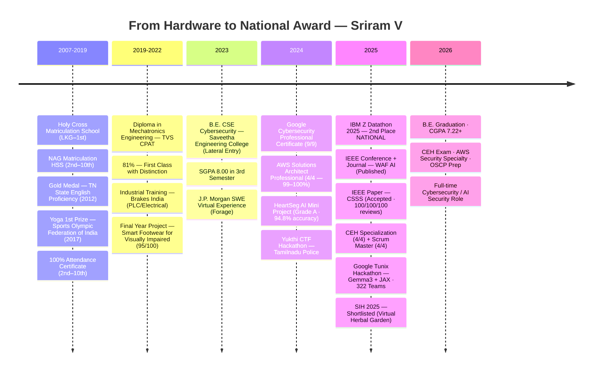

<div align="center">


<br/>

[](https://www.linkedin.com/in/sriram-v-38305a220/)
[](mailto:sriramnvks@gmail.com)
[](https://github.com/Darkwebnew)
[](https://tryhackme.com/p/sriramnvks)
[](https://www.kaggle.com/sriramnvks)
[](https://leetcode.com/u/Harish_Ammu)
[](https://www.credly.com/users/sriram-v.70fced2f)
[](https://ibmzxplore.ibm.com/profiles/91e762f6-978e-48a6-a61a-2311366a189a)
[](https://github.com/Darkwebnew)

</div>

<br/>

```python
# ═══════════════════════════════════════════════════════════════════
#  $ python3 --identify Darkwebnew
# ═══════════════════════════════════════════════════════════════════

engineer = {
    "name":       "Sriram V",
    "alias":      "Darkwebnew / Harish Ammu",
    "dob":        "15 November 2003",
    "blood":      "A+",
    "location":   "Chennai, Tamil Nadu, India 🇮🇳",
    "diploma":    "Mechatronics Engineering · TVS CPAT · 81% · 2022",
    "degree":     "B.E. CSE Cybersecurity · Saveetha Engineering College · 2026",
    "cgpa":       7.22,
    "roll":       "212222103002",

    "record": {
        "ibm_datathon_2025": "🏆 IBM Z Datathon 2025 — 2nd Place NATIONAL · $500 + IBM Mentorship",
        "ieee_waf_ai":       "📄 IEEE Conference + Journal — AI-Powered WAF (Published)",
        "ieee_csss":         "📄 IEEE Paper — Clinical Scan Support System (Accepted)",
        "google_tunix":      "🧪 Google Tunix Hackathon — 322 Teams · 11,173 Entrants · $100K Pool",
        "sih_2025":          "🌿 Smart India Hackathon 2025 — Shortlisted (SIH 1555)",
        "jp_morgan":         "💼 J.P. Morgan SWE Virtual Experience (Forage)",
    },

    "superpower": "Hardware → Software → Security. I build the device AND secure it.",
    "mission":    "Build intelligent systems that don't just defend — they adapt and outthink attackers.",
}
```


<h2 align="center">⚡ At a Glance</h2>

<div align="center">
<table>
<tr>
<td align="center" width="20%">
<br/>
<sub>$500 + IBM Mentorship + LICC</sub>
</td>
<td align="center" width="20%">
<br/>
<sub>WAF AI + CSSS</sub>
</td>
<td align="center" width="20%">
<br/>
<sub>Google · AWS · CEH · Scrum</sub>
</td>
<td align="center" width="20%">
<br/>
<sub>AI · Security · IoT · Cloud</sub>
</td>
<td align="center" width="20%">
<br/>
<sub>Every one taught me something</sub>
</td>
</tr>
</table>
</div>


<h2 align="center">📖 The Story</h2>

I started with curiosity — pulling hardware apart, figuring out how it works, then rebuilding it stronger. A **Mechatronics Diploma** gave me the hardware foundation most engineers never touch. A **B.E. in Cybersecurity** gave me the tools to protect it. The combination is rare, and it matters.

**IBM Z Datathon 2025 — 2nd Place Nationally.** Built an AI cardiac MRI classifier on IBM Z Mainframe. Won $500 + IBM mentorship + LICC access. A year of building led to two IEEE publications on AI-powered security systems.

Between competitions: **ML-powered WAF blocking zero-day exploits**, **clinical AI reducing diagnosis time**, **LLM fine-tuning with Gemma3 + JAX on TPU**, **hardware diagnostics tool**, **IoT assistive footwear**. Free community teaching on WhatsApp/Telegram/Instagram — helped **100+ people** recover hacked accounts and trace stolen phones using only Linux.

**One direction: AI systems that actively outthink attackers. Not reactive. Adaptive.**


<h2 align="center">🧠 Engineering Philosophy</h2>

<div align="center">
<table>
<tr>
<td align="center" width="33%">

```
┌─────────────────────┐
│   HARDWARE FIRST    │
│─────────────────────│
│ I have a            │
│ Mechatronics        │
│ diploma.            │
│                     │
│ I build the device. │
│ Then I secure it.   │
│ Nobody else does    │
│ both.               │
└─────────────────────┘
```

</td>
<td align="center" width="33%">

```
┌─────────────────────┐
│   ADAPTIVE AI       │
│─────────────────────│
│ Signature-based     │
│ security is dead.   │
│                     │
│ Build systems that  │
│ learn, evolve, and  │
│ outthink attackers  │
│ automatically.      │
└─────────────────────┘
```

</td>
<td align="center" width="33%">

```
┌─────────────────────┐
│   PROOF > POLISH    │
│─────────────────────│
│ National award.     │
│ IEEE publications.  │
│ 195+ repos.         │
│                     │
│ Talk is cheap.      │
│ Show the work.      │
│ Always.             │
└─────────────────────┘
```

</td>
</tr>
</table>
</div>


<h2 align="center">⚡ Domains</h2>

<div align="center">
<table>
<tr>
<td align="center" width="20%">

**🛡️ Cybersecurity**
<br/><br/>
Kali Linux · Metasploit<br/>
Burp Suite · Nmap · Nessus<br/>
OWASP Top 10 · WAF<br/>
Wireshark · Forensics<br/>
Aircrack-ng · John TR<br/>
<br/>
<sub>Think like the attacker.<br/>Build like the defender.</sub>

</td>
<td align="center" width="20%">

**🤖 AI / ML Security**
<br/><br/>
TensorFlow · PyTorch<br/>
OpenCV · scikit-learn<br/>
LangChain · HuggingFace<br/>
LLMs · RAG · Gemma3 + JAX<br/>
Healthcare AI · WAF AI<br/>
<br/>
<sub>Intelligence beats<br/>signatures every time.</sub>

</td>
<td align="center" width="20%">

**☁️ Cloud & DevOps**
<br/><br/>
AWS (EC2 · S3 · IAM · VPC)<br/>
IBM Cloud (COS · Db2)<br/>
GCP · Azure · IBM Z<br/>
Docker · Kubernetes<br/>
Prometheus · Grafana<br/>
<br/>
<sub>Cloud-native.<br/>DevSecOps ready.</sub>

</td>
<td align="center" width="20%">

**📡 IoT & Embedded**
<br/><br/>
Arduino · Raspberry Pi<br/>
ESP32 · MQTT · Node-RED<br/>
FreeRTOS · Zigbee<br/>
Embedded C/C++<br/>
Sensor Security<br/>
<br/>
<sub>Edge to cloud.<br/>Every node secured.</sub>

</td>
<td align="center" width="20%">

**⚙️ Mechatronics**
<br/><br/>
AutoCAD · SolidWorks<br/>
Fusion 360 · Revit<br/>
CNC · G-code · M-code<br/>
PLC · Siemens · HMI<br/>
Pneumatics · Robotics<br/>
<br/>
<sub>Hardware background<br/>nobody else has.</sub>

</td>
</tr>
</table>
</div>


<h2 align="center">🛠️ Tech Stack</h2>

<div align="center">

<table>
<tr>
<td align="center" width="70"><br><sub>Python</sub></td>
<td align="center" width="70"><br><sub>Java</sub></td>
<td align="center" width="70"><br><sub>C</sub></td>
<td align="center" width="70"><br><sub>C++</sub></td>
<td align="center" width="70"><br><sub>JavaScript</sub></td>
<td align="center" width="70"><br><sub>TypeScript</sub></td>
<td align="center" width="70"><br><sub>Bash</sub></td>
<td align="center" width="70"><br><sub>Rust</sub></td>
</tr>
<tr>
<td align="center"><br><sub>TensorFlow</sub></td>
<td align="center"><br><sub>PyTorch</sub></td>
<td align="center"><br><sub>OpenCV</sub></td>
<td align="center"><br><sub>Docker</sub></td>
<td align="center"><br><sub>Linux</sub></td>
<td align="center"><br><sub>Git</sub></td>
<td align="center"><br><sub>Arduino</sub></td>
<td align="center"><br><sub>RPi</sub></td>
</tr>
<tr>
<td align="center"><br><sub>Flask</sub></td>
<td align="center"><br><sub>React</sub></td>
<td align="center"><br><sub>PostgreSQL</sub></td>
<td align="center"><br><sub>MySQL</sub></td>
<td align="center"><br><sub>Redis</sub></td>
<td align="center"><br><sub>VS Code</sub></td>
<td align="center"><br><sub>Jupyter</sub></td>
<td align="center"><br><sub>Figma</sub></td>
</tr>
</table>

<br/>


</div>


<h2 align="center">🚀 Featured Repositories</h2>

<div align="center">
<table>
<tr>
<td width="50%" valign="top">

### [`AI-Powered-Heart-MRI-Classification`](https://github.com/Darkwebnew/AI-Powered-Heart-MRI-Classification-for-Clinical-Decision-Support)


National award-winning CNN for cardiac MRI classification on IBM Z Mainframe. Grad-CAM explainability, IBM Cloud COS + Db2, <2s inference, secured patient pipelines.

`Python` `TensorFlow` `IBM Z` `IBM Cloud` `Grad-CAM` `OpenCV`

</td>
<td width="50%" valign="top">

### [`AI-Powered-Advanced-Web-Application-Firewall`](https://github.com/Darkwebnew/Projectwork1)


ML WAF blocking SQLi, XSS, CSRF & zero-days in real-time. Isolation Forest + Random Forest. Auto rule generation, Prometheus/Grafana monitoring, zero-downtime reloads.

`FastAPI` `scikit-learn` `Docker` `Prometheus` `Grafana` `Nginx`

</td>
</tr>
<tr>
<td width="50%" valign="top">

### [`Clinical-Scan-Support-System`](https://github.com/Darkwebnew/Projectwork2)


89.51% MobileNetV2 accuracy. 4-role clinical workflow (Patient/Doctor/Pharmacist/Admin), OTP 2FA, auto PDF report generation. Reviews: 100/100/100.

`FastAPI` `Next.js` `MobileNetV2` `SQLite` `WeasyPrint`

</td>
<td width="50%" valign="top">

### [`Gemma3-LLM-Reasoning-Tunix`](https://www.kaggle.com/code/sriramnvks/gemma3-1b-model-in-tunix)


Fine-tuned Gemma3 1B using Google's JAX-native Tunix library for step-by-step LLM reasoning. Full RLHF pipeline on TPU. `<reasoning>...<answer>` format.

`Python` `Gemma3 1B` `JAX` `TPU` `RLHF/RLAIF`

</td>
</tr>
<tr>
<td width="50%" valign="top">

### [`HeartSeg-AI`](https://github.com/Darkwebnew/Miniproject)


U-Net cardiac MRI segmentation with 94.8% accuracy. 6-disease classifier with Flask web interface. The foundation that led to the IBM Z Datathon win.

`Python` `TensorFlow` `U-Net` `Flask` `OpenCV`

</td>
<td width="50%" valign="top">

### [`Device-Doctor`](https://github.com/Darkwebnew/Device-Doctor)


Cross-platform hardware diagnostics. CPU/GPU/RAM/SMART detection, health score (0–100), performance tier, driver audit. Built for real users.

`Electron` `Node.js` `systeminformation` `PowerShell`

</td>
</tr>
<tr>
<td width="50%" valign="top">

### [`AI-Smart-Resume-Analyzer-2026`](https://github.com/VishwaRathinam14/AI-Smart-Resume-2026)


ATS score, keyword gap analysis, resume builder (4 templates), LinkedIn scraping. Streamlit + Google Gemini API + spaCy + Selenium.

`Streamlit` `Google Gemini API` `spaCy` `Selenium` `SQLite`

</td>
<td width="50%" valign="top">

### [`Smart-Footwear-Visually-Impaired`](https://github.com/Darkwebnew/Design-And-Modelling-Of-Footwear-For-Visually-Impared)


HC-SR04 ultrasonic obstacle detection (2cm–400cm), haptic feedback, piezoelectric self-charging, 17-day battery life. Led a 6-member team.

`Arduino Nano` `Embedded C++` `MQTT` `Node-RED` `Piezoelectric`

</td>
</tr>
</table>
</div>


<h2 align="center">🗺️ Journey Timeline</h2>



<div align="center">

| Year | Milestone | Significance |
|:---:|:---|:---|
| **2022** | **Diploma — Mechatronics · 81%** | Hardware foundation nobody else has |
| **2023** | B.E. CSE Cybersecurity — Lateral Entry | Skipped 1st year, joined 3rd sem directly |
| **2024** | Google Cybersecurity Professional (9/9) | 91–100% across all 9 courses |
| **2024** | AWS Solutions Architect (4/4 · 99–100%) | Cloud security foundation |
| **2025** | **🏆 IBM Z Datathon 2025 — 2nd NATIONAL** | $500 + IBM Mentorship + LICC + Bangalore Labs |
| **2025** | **📄 IEEE Conference + Journal — WAF AI** | Published research on ML-powered security |
| **2025** | **📄 IEEE CSSS — Accepted** | 100/100/100 review scores |
| **2025** | Google Tunix Hackathon — Gemma3 + JAX | 322 teams, 11K+ entrants, $100K pool |
| **2025** | CEH Specialization · Scrum Master · 50+ certs | Depth across security + cloud + agile |
| **2026** | CEH Exam · AWS Security Specialty · OSCP | In progress — full certification stack |

</div>


<h2 align="center">📜 Certifications</h2>

<div align="center">

| Domain | Certification | Score |
|:---|:---|:---:|
| 🔐 **Cybersecurity** | Google Cybersecurity Professional Certificate (9/9 courses) | 91–100% |
| 🔐 **Ethical Hacking** | CEH v12 Specialization — LearnKartS (4/4 courses) | 83–100% |
| ☁️ **Cloud** | AWS Cloud Solutions Architect Professional (4/4 courses) | 99–100% |
| ⚡ **Agile** | Scrum Master Certification Specialization — LearnQuest (4/4) | 86–100% |
| 🤖 **AI** | Generative AI — IBM / Coursera | ✅ |
| 🔗 **Blockchain** | Blockchain for Business — Linux Foundation | ✅ |
| 📡 **IoT** | Architecting Smart IoT Devices — EIT Digital | 86.39% |
| 🔐 **IoT Security** | Security for IoT — Embedded Systems | ✅ |
| 🕵️ **Forensics** | Digital Forensics Concepts — Infosec | 100% |
| 🌐 **Web** | Django (100%) · HTML/CSS Meta (95.46%) · Bootstrap (100%) | ✅ |
| 💼 **Industry** | J.P. Morgan SWE Job Simulation — Forage | Sep 2024 |
| 🎯 **In Progress** | **CEH · AWS Security Specialty · OSCP** | 🔄 |

**Badges:** AWS Educate Cloud 101 · AWS Educate GenAI · AWS Educate ML Foundations · IBM Z Day 2025 AI & Data · IBM Z Day 2025 Security · IBM Z Xplore Concepts · Cisco Introduction to IoT · Kaggle: Vampire · Python Coder · Dataset Creator · IBM Z Day 2024 Security

</div>


<h2 align="center">🎖️ Community & Teaching</h2>

<div align="center">
<table>
<tr>
<td align="center" width="33%">

**🔓 Account Recovery**
<br/><br/>
Recovered hacked Facebook & email accounts for free. Bypassed locked 2-step verification using only Linux and free tools.

</td>
<td align="center" width="33%">

**📱 Phone Tracing**
<br/><br/>
Traced 100s of lost and stolen mobile phones. No paid services. Linux only. Real results for real people who needed help.

</td>
<td align="center" width="33%">

**👨‍🏫 Free Education**
<br/><br/>
Runs active WhatsApp · Telegram · Instagram communities teaching ethical hacking and Linux basics to 100+ people — completely free.

</td>
</tr>
</table>
</div>

<div align="center">

`IBM Volunteer 2024` · `Community Teacher` · `Hardware Repair Specialist` · `Freelance Web Developer`

> *"Security knowledge gatekept is security knowledge wasted."*

</div>


<h2 align="center">📊 GitHub Activity</h2>

<div align="center">


<br/><br/>


<br/><br/>


<br/><br/>


</div>


<h2 align="center">🎯 Current Vector</h2>

```
┌─────────────────────────────────────────────────────────────────────┐
│                                                                     │
│   NOW        CEH Exam · AWS Security Specialty · OSCP Prep          │
│              LLM Fine-tuning & RAG Security Pipelines               │
│              AI-powered Real-time Threat Detection Engine           │
│              Cloud-native Security Architecture on AWS              │
│                                                                     │
│   NEXT       HackTheBox Pro Hacker Rank                             │
│              Cybersecurity / AI Security Internship                 │
│              Tech Blogs: WAF · Cloud Security · Healthcare AI       │
│              Portfolio Website Upgrade                              │
│              Speak at Cybersecurity or AI Conference                │
│                                                                     │
│   TARGET     Full-time Cybersecurity or AI Security Engineer        │
│              AI Security Researcher                                 │
│              DevSecOps / Cloud Security Architect                   │
│                                                                     │
└─────────────────────────────────────────────────────────────────────┘
```


<h2 align="center">💡 Why Work With Me</h2>

<div align="center">
<table>
<tr>
<td align="center" width="25%">
<h3>🏆</h3>
<strong>Competition-Tested</strong><br/>
<sub>National 2nd at IBM Z Datathon. $500 + IBM mentorship. Not just coursework — results under real pressure.</sub>
</td>
<td align="center" width="25%">
<h3>⚙️</h3>
<strong>Unique Hardware + Software</strong><br/>
<sub>Mechatronics diploma + B.E. Cybersecurity. AutoCAD, PLC, CNC + Metasploit, WAF, Cloud. Nobody else has both.</sub>
</td>
<td align="center" width="25%">
<h3>📄</h3>
<strong>Research-Grade Work</strong><br/>
<sub>2 IEEE publications. WAF AI conference + journal. CSSS accepted with 100/100/100 reviews. Proven depth.</sub>
</td>
<td align="center" width="25%">
<h3>🔐</h3>
<strong>Adaptive Security Mindset</strong><br/>
<sub>I don't build reactive systems. ML WAF, AI threat detection, LLM-based security. Always one step ahead.</sub>
</td>
</tr>
</table>
</div>

<br/>

<div align="center">


<br/><br/>

### **Building AI systems that don't just defend — they adapt, evolve, and outthink attackers.**

<br/>

[](https://www.linkedin.com/in/sriram-v-38305a220/)
&nbsp;
[](mailto:sriramnvks@gmail.com)
&nbsp;
[](https://github.com/Darkwebnew)
&nbsp;
[](https://buymeacoffee.com/sriramnvks)

<br/>


</div>


<p align="center">

<br/>
<em>⭐ Star my repos if they helped you! · Made with ❤️ + ☕ in Chennai 🇮🇳</em><br/>
Created with 🖤 by <a href="https://github.com/Darkwebnew">Sriram V</a>
</p>
