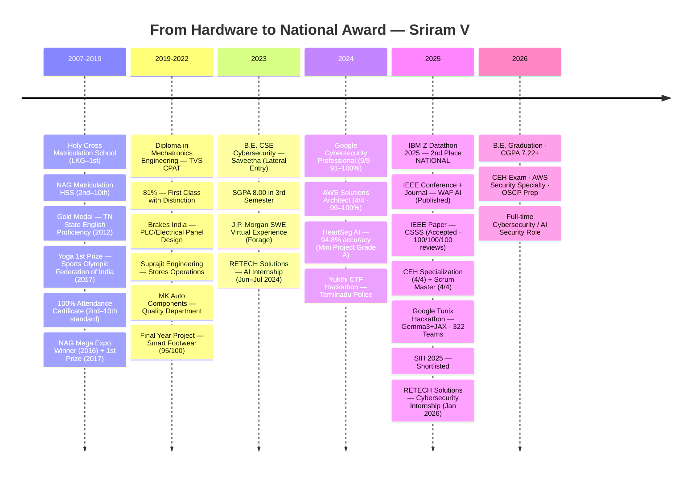

<div align="center">


<br/>

[](https://www.linkedin.com/in/sriram-v-38305a220/)
[](mailto:sriramnvks@gmail.com)
[](https://github.com/Darkwebnew)
[](https://tryhackme.com/p/sriramnvks)
[](https://www.kaggle.com/sriramnvks)
[](https://leetcode.com/u/Harish_Ammu)
[](https://www.credly.com/users/sriram-v.70fced2f)
[](https://ibmzxplore.ibm.com/profiles/91e762f6-978e-48a6-a61a-2311366a189a)
[](https://buymeacoffee.com/sriramnvks)
[](https://github.com/Darkwebnew)

</div>

<br/>

```python
# ═══════════════════════════════════════════════════════════════════
#  $ python3 --identify Darkwebnew
# ═══════════════════════════════════════════════════════════════════

engineer = {
    "name":       "Sriram V",
    "alias":      "Darkwebnew / Harish Ammu",
    "dob":        "15 November 2003",
    "blood":      "A+",
    "location":   "Chennai, Tamil Nadu, India 🇮🇳",
    "diploma":    "Mechatronics Engineering · TVS CPAT · 81% · 2022",
    "degree":     "B.E. CSE Cybersecurity · Saveetha Engineering College · 2026",
    "cgpa":       7.22,
    "roll":       "212222103002",

    "record": {
        "ibm_datathon_2025": "🏆 IBM Z Datathon 2025 — 2nd Place NATIONAL · $500 + IBM Mentorship",
        "ieee_waf_ai":       "📄 IEEE Conference + Journal — AI-Powered WAF (Published)",
        "ieee_csss":         "📄 IEEE Paper — Clinical Scan Support System (Accepted · 100/100/100)",
        "google_tunix":      "🧪 Google Tunix Hackathon — 322 Teams · 11,173 Entrants · $100K Pool",
        "sih_2025":          "🌿 Smart India Hackathon 2025 — Shortlisted (SIH 1555)",
        "jp_morgan":         "💼 J.P. Morgan SWE Virtual Experience (Forage)",
        "yoga_national":     "🧘 Yoga 1st Prize — Sports Olympic Federation of India (2017)",
        "english_gold":      "🥇 Gold Medal — TN State English Proficiency Test (2012)",
    },

    "superpower": "Hardware → Software → Security. I build the device AND secure it.",
    "mission":    "Build AI systems that don't just defend — they adapt and outthink attackers.",
}
```


<h2 align="center">⚡ At a Glance</h2>

<div align="center">
<table>
<tr>
<td align="center" width="20%">
<br/>
<sub>$500 + IBM Mentorship + LICC ($10K+)</sub>
</td>
<td align="center" width="20%">
<br/>
<sub>WAF AI Conference + Journal + CSSS</sub>
</td>
<td align="center" width="20%">
<br/>
<sub>Google · AWS · CEH · Scrum · More</sub>
</td>
<td align="center" width="20%">
<br/>
<sub>AI · Security · IoT · Cloud · HW</sub>
</td>
<td align="center" width="20%">
<br/>
<sub>Every one taught me something</sub>
</td>
</tr>
</table>
</div>


<h2 align="center">📖 The Story</h2>

I started young — handwriting medals, English gold medals, yoga state championships, 100% attendance, science expo wins. That discipline and curiosity never left.

A **Mechatronics Diploma** (TVS CPAT, 81%) gave me the hardware foundation most engineers never touch — PLC programming at Brakes India, quality systems at MK Auto Components, CNC, embedded C, robotics. A **B.E. in Cybersecurity** gave me the tools to protect what I build. The combination is rare.

**IBM Z Datathon 2025 — 2nd Place Nationally.** Built an AI cardiac MRI classifier on IBM Z Mainframe. Won $500 + IBM mentorship + LICC access. That led to two IEEE publications on AI-powered security systems and a trip to IBM Bangalore Labs.

Between competitions: **ML-powered WAF that blocks zero-day exploits**, **clinical AI reducing diagnosis time from hours to 60 seconds**, **LLM fine-tuning with Gemma3 + JAX on TPU**, and **IoT assistive footwear with piezoelectric self-charging**. Free community teaching — helped **100+ people** recover hacked accounts and trace stolen phones using only Linux.

**One direction: security that learns faster than attackers attack.**


<h2 align="center">🧠 Engineering Philosophy</h2>

<div align="center">
<table>
<tr>
<td align="center" width="33%">

```
┌─────────────────────┐
│   HARDWARE FIRST    │
│─────────────────────│
│ Mechatronics        │
│ diploma. PLC. CNC.  │
│ Robotics. Circuits. │
│                     │
│ I build the device. │
│ Then I secure it.   │
│ Nobody else does    │
│ both.               │
└─────────────────────┘
```

</td>
<td align="center" width="33%">

```
┌─────────────────────┐
│   ADAPTIVE AI       │
│─────────────────────│
│ Signature-based     │
│ security is dead.   │
│                     │
│ Build systems that  │
│ learn, evolve, and  │
│ outthink attackers  │
│ automatically.      │
└─────────────────────┘
```

</td>
<td align="center" width="33%">

```
┌─────────────────────┐
│   PROOF > POLISH    │
│─────────────────────│
│ National award.     │
│ IEEE publications.  │
│ 195+ repos.         │
│ 100% attendance.    │
│                     │
│ Talk is cheap.      │
│ Show the work.      │
└─────────────────────┘
```

</td>
</tr>
</table>
</div>


<h2 align="center">⚡ Domains</h2>

<div align="center">
<table>
<tr>
<td align="center" width="20%">

**🛡️ Cybersecurity**
<br/><br/>
Kali Linux · Metasploit<br/>
Burp Suite · Nmap · Nessus<br/>
OWASP Top 10 · WAF<br/>
Wireshark · Forensics<br/>
Aircrack-ng · John TR<br/>
<br/>
<sub>Think like attacker.<br/>Build like defender.</sub>

</td>
<td align="center" width="20%">

**🤖 AI / ML Security**
<br/><br/>
TensorFlow · PyTorch<br/>
OpenCV · scikit-learn<br/>
LangChain · HuggingFace<br/>
LLMs · RAG · Gemma3+JAX<br/>
Healthcare AI · WAF AI<br/>
<br/>
<sub>Intelligence beats<br/>signatures always.</sub>

</td>
<td align="center" width="20%">

**☁️ Cloud & DevOps**
<br/><br/>
AWS (EC2·S3·IAM·VPC)<br/>
IBM Cloud (COS·Db2)<br/>
GCP · Azure · IBM Z<br/>
Docker · Kubernetes<br/>
Prometheus · Grafana<br/>
<br/>
<sub>Cloud-native.<br/>DevSecOps ready.</sub>

</td>
<td align="center" width="20%">

**📡 IoT & Embedded**
<br/><br/>
Arduino · Raspberry Pi<br/>
ESP32 · MQTT · Node-RED<br/>
FreeRTOS · Zigbee<br/>
Embedded C/C++<br/>
Sensor Security<br/>
<br/>
<sub>Edge to cloud.<br/>Every node secured.</sub>

</td>
<td align="center" width="20%">

**⚙️ Mechatronics**
<br/><br/>
AutoCAD · SolidWorks<br/>
Fusion 360 · Revit<br/>
CNC · G-code · M-code<br/>
PLC · Siemens · HMI<br/>
Pneumatics · Robotics<br/>
<br/>
<sub>Hardware foundation<br/>nobody else has.</sub>

</td>
</tr>
</table>
</div>


<h2 align="center">🛠️ Tech Stack</h2>

<div align="center">

<table>
<tr>
<td align="center" width="70"><br><sub>Python</sub></td>
<td align="center" width="70"><br><sub>Java</sub></td>
<td align="center" width="70"><br><sub>C</sub></td>
<td align="center" width="70"><br><sub>C++</sub></td>
<td align="center" width="70"><br><sub>JavaScript</sub></td>
<td align="center" width="70"><br><sub>TypeScript</sub></td>
<td align="center" width="70"><br><sub>Bash</sub></td>
<td align="center" width="70"><br><sub>Rust</sub></td>
</tr>
<tr>
<td align="center"><br><sub>TensorFlow</sub></td>
<td align="center"><br><sub>PyTorch</sub></td>
<td align="center"><br><sub>OpenCV</sub></td>
<td align="center"><br><sub>Docker</sub></td>
<td align="center"><br><sub>Linux</sub></td>
<td align="center"><br><sub>Git</sub></td>
<td align="center"><br><sub>Arduino</sub></td>
<td align="center"><br><sub>RPi</sub></td>
</tr>
<tr>
<td align="center"><br><sub>Flask</sub></td>
<td align="center"><br><sub>React</sub></td>
<td align="center"><br><sub>PostgreSQL</sub></td>
<td align="center"><br><sub>MySQL</sub></td>
<td align="center"><br><sub>Redis</sub></td>
<td align="center"><br><sub>VS Code</sub></td>
<td align="center"><br><sub>Jupyter</sub></td>
<td align="center"><br><sub>Figma</sub></td>
</tr>
</table>

<br/>


</div>


<h2 align="center">🏆 Early Achievements — School (2010 – 2019)</h2>

<div align="center">
<table>
<tr>
<td align="center" width="33%">

**🥇 Academic Excellence**
<br/><br/>
Gold Medal — Tamil Nadu State Level English Proficiency Test · Bharath Institute of English (2012)<br/><br/>
State Level Handwriting & Essay Writing Certificates · Monalisa Academy (2011)<br/><br/>
NAG Mega Expo — **Winner (2016)** and **1st Prize (2017)** (won Oxford Dictionary)

</td>
<td align="center" width="33%">

**🧘 Sports & Discipline**
<br/><br/>
Yoga **1st Prize** + Shield — Sports Olympic Federation of India, Puducherry (2017) + Yoga Nakshatra Certification<br/><br/>
Yoga **2nd Prize** + Shield — Tamil Nadu Sports Olympic Association (2016)<br/><br/>
Football **2nd Prize** + Silver Medal — School Sports Day (2016–2017)

</td>
<td align="center" width="33%">

**📅 Consistency**
<br/><br/>
**100% Attendance** from 2nd to 10th Standard — Official school certificate recognizing 9 years of perfect discipline<br/><br/>
Unified Cyber Olympiad 2014 — Early technology exposure<br/><br/>
SBI Young Artist · Osho Draw Kids · Bring Star Academy Tamil Handwriting 2nd Prize

</td>
</tr>
</table>
</div>


<h2 align="center">🗺️ Journey Timeline</h2>



<div align="center">

| Year | Milestone | Significance |
|:---:|:---|:---|
| **2019** | **Diploma Mechatronics — 81% First Class Distinction** | Hardware foundation no software engineer has |
| **2021** | Brakes India — PLC & Electrical Panel Training | Real industrial automation experience |
| **2022** | Smart Footwear Project — 95/100 · Led 6 members | First engineering project with real-world impact |
| **2023** | B.E. CSE Cybersecurity — Lateral Entry, SGPA 8.00 | Strong start after diploma |
| **2024** | Google Cybersecurity (9/9) · AWS Solutions Architect (4/4) | 91–100% grades across 13 professional courses |
| **2024** | RETECH Solutions AI Internship | Real industry exposure |
| **2025** | **🏆 IBM Z Datathon 2025 — 2nd NATIONAL** | $500 + IBM Mentorship + LICC + Bangalore Labs |
| **2025** | **📄 IEEE Conference + Journal — WAF AI** | Published ML security research |
| **2025** | **📄 IEEE CSSS — Accepted** | 100/100/100 review scores |
| **2025** | Google Tunix Hackathon · SIH Shortlisted · 50+ certs | Depth proved across multiple domains |
| **2026** | RETECH Cybersecurity Internship · B.E. Final Year | Production-ready engineer |

</div>


<h2 align="center">🎓 Education</h2>

<div align="center">
<table>
<tr>
<td width="50%" valign="top">

### 🔵 B.E. CSE — Cybersecurity *(Lateral Entry)*
**Saveetha Engineering College, Chennai**
`2023 – 2026` · CGPA: **7.22** (~68–72%) · Roll: 212222103002

Joined directly in 3rd sem (skipped 1st year).

```
S3:8.00 → S4:7.04 → S5:7.31 → S6:7.12 → S7:6.89
```

| Subject | Grade | ~% |
|:--------|:------|:---|
| Ethical Hacking Techniques | A | 70–79% |
| Cloud Security | A | 70–79% |
| Cloud Computing | A | 70–79% |
| DBMS | A | 70–79% |
| Java OOP | A | 70–79% |
| Data Structures | A | 70–79% |
| Web Development | A | 70–79% |
| Software Engineering | A | 70–79% |
| Cryptography | B+ | 60–69% |
| IoT Security | B+ | 60–69% |
| Blockchain for Business | B+ | 60–69% |
| Scrum Master | A+ | 80–89% |
| Smart IoT Devices | O | 90–100% |
| Project Work I (WAF AI) | A+ | 80–89% |
| Mini Project (HeartSeg) | A | 70–79% |

</td>
<td width="50%" valign="top">

### 🟡 Diploma — Mechatronics Engineering
**TVS CPAT (T.V. Srinivasan Polytechnic), Chennai**
`2019 – 2022` · **81% — First Class with Distinction**

3½ year Sandwich program with 3 industrial internships.

**🏆 Top Scores:**

| Subject | Score |
|:--------|:------|
| Programming in C Practical | 100% |
| Engineering Physics Practical | 100% |
| Workshop Practical | 95% |
| Project Work | 95% |
| Robotics Practical | 93% |
| Industrial Training II | 91% |
| Engineering Maths II | 91% |
| CAD Practical | 90% |
| Process Control Practical | 90% |
| Engineering Graphics | 88% |
| Mechanics of Materials | 90% |

Industrial Training:
`Brakes India — PLC/Electrical` · `Suprajit Engineering — Stores` · `MK Auto Components — Quality`

</td>
</tr>
</table>
</div>


<h2 align="center">🚀 Featured Repositories</h2>

<div align="center">
<table>
<tr>
<td width="50%" valign="top">

### [`AI-Powered-Heart-MRI-Classification`](https://github.com/Darkwebnew/AI-Powered-Heart-MRI-Classification-for-Clinical-Decision-Support)


National award-winning CNN on IBM Z Mainframe. Grad-CAM + Integrated Gradients explainability. IBM Cloud COS + Db2. Secured patient pipelines. **$500 + IBM mentorship + LICC ($10K+).**

`Python` `TensorFlow` `IBM Z` `IBM Cloud` `Grad-CAM` `MobileNetV2`

</td>
<td width="50%" valign="top">

### [`AI-Powered-Advanced-Web-Application-Firewall`](https://github.com/Darkwebnew/Projectwork1)


ML WAF blocking SQLi, XSS, CSRF & zero-days. Isolation Forest + Random Forest. Auto nginx rule generation. Multi-node SSH deployment. Prometheus/Grafana/Loki observability.

`FastAPI` `scikit-learn` `Docker` `Prometheus` `Grafana` `Nginx` `Redis`

</td>
</tr>
<tr>
<td width="50%" valign="top">

### [`Clinical-Scan-Support-System`](https://github.com/Darkwebnew/Projectwork2)


Full-stack AI diagnostics. 4-role hospital workflow, OTP 2FA, WeasyPrint auto PDF, email delivery. Trained on 217,875 medical images. Grad-CAM explainability.

`FastAPI` `Next.js 14` `MobileNetV2` `SQLite` `WeasyPrint` `JWT`

</td>
<td width="50%" valign="top">

### [`HeartSeg-AI`](https://github.com/Darkwebnew/Miniproject)


U-Net cardiac MRI segmentation. 6-disease classifier. Reduced diagnosis from hours to under 60 seconds. Foundation that led to IBM Z Datathon win.

`Python` `TensorFlow` `U-Net` `Flask` `OpenCV` `Keras`

</td>
</tr>
<tr>
<td width="50%" valign="top">

### [`Gemma3-LLM-Reasoning-Tunix`](https://www.kaggle.com/code/sriramnvks/gemma3-1b-model-in-tunix)


Fine-tuned Gemma3 1B using JAX-native Tunix library for step-by-step LLM reasoning. Full RLHF/RLAIF pipeline on TPU. `<reasoning>...<answer>` structured output.

`Gemma3 1B` `JAX` `TPU` `RLHF` `RLAIF` `Python`

</td>
<td width="50%" valign="top">

### [`Device-Doctor`](https://github.com/Darkwebnew/Device-Doctor)


Cross-platform hardware diagnostics. CPU/GPU/RAM/SMART detection, health score, performance tier, driver audit. Built for real users who repair their own machines.

`Electron` `Node.js` `systeminformation` `PowerShell`

</td>
</tr>
<tr>
<td width="50%" valign="top">

### [`Smart-Footwear-Visually-Impaired`](https://github.com/Darkwebnew/Design-And-Modelling-Of-Footwear-For-Visually-Impared)


Obstacle detection 2cm–400cm (±0.3cm accuracy). Silent haptic feedback, 3-zone vibration alerts. Piezoelectric self-charging from walking motion. Li-Ion battery.

`Arduino Nano` `Embedded C++` `HC-SR04` `Piezoelectric` `TP4056`

</td>
<td width="50%" valign="top">

### [`AI-Smart-Resume-Analyzer-2026`](https://github.com/VishwaRathinam14/AI-Smart-Resume-2026)


ATS score, keyword gap analysis, resume builder (4 templates), LinkedIn scraping. Built with Vishwa Rathinam.

`Streamlit` `Google Gemini API` `spaCy` `Selenium` `SQLite`

</td>
</tr>
</table>
</div>


<h2 align="center">💼 Internships & Industrial Training</h2>

<div align="center">

| Period | Organization | Role | Key Learning |
|:-------|:-------------|:-----|:-------------|
| **Jan 2026** (2 weeks) | RETECH Solutions, Chennai | Cybersecurity Intern | Penetration testing, security workflows, hands-on exposure |
| **Jun–Jul 2024** (1 month) | RETECH Solutions, Chennai | AI Intern | ML workflows, deployment concepts, real AI pipeline |
| **Aug–Dec 2022** (5 months) | MK Auto Components, Ambattur | Quality Department | Quality inspection, manufacturing QC, industrial standards |
| **Jul–Aug 2022** (3 weeks) | Suprajit Engineering, Kanchipuram | Stores Operations | Inventory, material management, supply chain |
| **Mar–May 2021** (3 months) | **Brakes India, Padi** | Electrical Department | **Panel board design, PLC ladder logic, industrial control systems (SS+)** |

</div>


<h2 align="center">📜 Certifications</h2>

<div align="center">

| Domain | Certification | Score |
|:---|:---|:---:|
| 🔐 **Cybersecurity** | Google Cybersecurity Professional (9/9 courses) | 91–100% |
| 🔐 **Ethical Hacking** | CEH v12 Specialization — LearnKartS (4/4 courses) | 83–100% |
| ☁️ **Cloud** | AWS Cloud Solutions Architect Professional (4/4 courses) | 99–100% |
| ⚡ **Agile** | Scrum Master Certification Specialization — LearnQuest (4/4) | 86–100% |
| 🤖 **AI** | Generative AI — IBM / Coursera | ✅ |
| 🔗 **Blockchain** | Blockchain for Business — Linux Foundation | ✅ |
| 📡 **IoT** | Architecting Smart IoT Devices — EIT Digital | 86.39% |
| 🔐 **IoT Security** | Security for IoT — Embedded Systems | ✅ |
| 🕵️ **Forensics** | Digital Forensics Concepts — Infosec | 100% |
| 🌐 **Web** | Django (100%) · HTML/CSS Meta (95.46%) · Bootstrap (100%) | ✅ |
| 💼 **Industry** | J.P. Morgan SWE Job Simulation — Forage | Sep 2024 |
| 🎯 **In Progress** | **CEH · AWS Security Specialty · OSCP** | 🔄 |

**Verified Badges:** AWS Educate Cloud 101 · AWS Educate GenAI · AWS Educate ML Foundations · IBM Z Day 2025 AI & Data · IBM Z Day 2025 Security · IBM Z Xplore Concepts · Cisco IoT · Kaggle: Vampire · Python Coder · Dataset Creator · IBM Z Day 2024 Security · J.P. Morgan Forage

</div>


<h2 align="center">💼 Freelance & Technical Writing</h2>

<div align="center">

| 💻 Freelance Work | ✍️ Technical Writing | 🔧 Open Source (Planned) |
|:-----------------|:---------------------|:-------------------------|
| **Web Development** – Built e‑commerce sites & company landing pages (paid clients)<br/>**Hardware Repair** – Mobile phones, laptops, electronics (paid services)<br/>**Security Consulting** – Available for penetration testing, WAF setup, cloud security reviews | *Coming soon:*<br/>• Building an AI‑Powered WAF – Architecture & Lessons<br/>• OWASP Top 10 for Modern Web Apps<br/>• Deploying ML Models with Docker & FastAPI<br/>• IBM Z Datathon 2025 – A Technical Retrospective | • Contributing to OWASP projects<br/>• Submitting PRs to FastAPI / Streamlit<br/>• Writing security tools in Python |

</div>

> **📢 Note:** I no longer offer free account recovery or phone tracing. If you need professional cybersecurity services, please reach out via [LinkedIn](https://www.linkedin.com/in/sriram-v-38305a220/) or email. **Paid consulting only.**


<h2 align="center">💡 Academic Context — Resilience Over Perfection</h2>

```
┌─────────────────────────────────────────────────────────────────────────────┐
│                                                                             │
│   ANALYSIS OF ALGORITHMS (U — Sem 7)                                        │
│   Internal marks: 95%+ average · Perfect lab records · Skill Assess: 100    │
│   External exam MISSED due to: Right hand fracture during Sem 7 exams       │
│   This U does NOT reflect knowledge. Internal performance proves mastery.   │
│                                                                             │
│   ACADEMIC TRAJECTORY (Lateral Entry — Started from 3rd Semester):          │
│   Sem3: 8.00 → Sem4: 7.04 → Sem5: 7.31 → Sem6: 7.12 → CGPA: 7.22            │
│                                                                             │
│   While maintaining 7+ CGPA, I simultaneously:                              │
│   → Won IBM Z Datathon 2025 — 2nd Place National                            │
│   → Published 2 IEEE papers (WAF AI + CSSS)                                 │
│   → Built 12+ production-grade projects                                     │
│   → Completed 50+ professional certifications                               │
│                                                                             │
│   "My projects speak louder than my exam grades."                           │
│                                                                             │
└─────────────────────────────────────────────────────────────────────────────┘
```


<h2 align="center">📊 GitHub Activity</h2>

<div align="center">


<br/><br/>


<br/><br/>


</div>

</div>


<h2 align="center">📚 Academic Labs</h2>

<details>
<summary><b>🔐 Cryptography — 15+ Algorithms Implemented from Scratch</b></summary>
<br>

| Algorithm | Category | Link |
|:----------|:---------|:-----|
| Caesar Cipher | Classical | [Repo](https://github.com/Darkwebnew/Ex-1-Caesar-Cipher) |
| PlayFair / Hill / Vigenère | Classical/Matrix | [Repo](https://github.com/Darkwebnew) |
| DES | Symmetric | [Repo](https://github.com/Darkwebnew/Ex-7-Implement-DES-Encryption-and-Decryption) |
| AES | Symmetric | [Repo](https://github.com/Darkwebnew/Ex-8-Implement-the-AES-Encryption-and-decryption) |
| RSA | Asymmetric | [Repo](https://github.com/Darkwebnew/Ex-9-RSA-Encryption-Algorithm) |
| ECC | Asymmetric | [Repo](https://github.com/Darkwebnew/Ex-11-Elliptic-Curve-Cryptography-ECC) |
| Diffie-Hellman | Key Exchange | [Repo](https://github.com/Darkwebnew/Ex-10-Diffie-Hellman-Key-Exchange-Algorithm) |
| SHA Hash | Integrity | [Repo](https://github.com/Darkwebnew/Ex-14-Hash-Algorithm) |
| ElGamal · MAC · PRNG | Various | [Repo](https://github.com/Darkwebnew) |

</details>

<details>
<summary><b>🕵️ Digital Forensics — Autopsy · Sleuth Kit · Wireshark · John the Ripper · StegExpose</b></summary>
<br>

| Lab | Tools |
|:----|:------|
| [Disk Structure Analysis](https://github.com/Darkwebnew/Analysis-of-the-Disk-Structure-using-Sleuth-Kit) | Sleuth Kit |
| [File Recovery](https://github.com/Darkwebnew/File-Recovery-using-Autopsy) | Autopsy |
| [Network Traffic Analysis](https://github.com/Darkwebnew/Network-traffic-capture-and-analysis-with-Wireshark-) | Wireshark |
| [Steganography Detection](https://github.com/Darkwebnew/-Detecting-steganography-with-tools-like-StegExpose-analyzing-file-signatures) | StegExpose |
| [Password Cracking](https://github.com/Darkwebnew/Using-tools-like-John-the-Ripper-for-password-cracking-) | John the Ripper |
| [Metadata Extraction](https://github.com/Darkwebnew/Metadata-Extraction-using-ExifTool-log2timeline-and-Hidden-Data-Search-using-Steganography-Tools) | ExifTool · log2timeline |

</details>

<details>
<summary><b>🤖 ML Algorithms · AI Algorithms · Pentesting Labs</b></summary>
<br>

**ML Labs:**
[SVM Spam](https://github.com/Darkwebnew/Implementation-of-SVM-For-Spam-Mail-Detection) · [K-Means Clustering](https://github.com/Darkwebnew/Implementation-of-K-Means-Clustering-for-Customer-Segmentation) · [Decision Tree](https://github.com/Darkwebnew/Implementation-of-Decision-Tree-Classifier-Model-for-Predicting-Employee-Churn) · [Logistic Regression](https://github.com/Darkwebnew/Implementation-of-Logistic-Regression-Model-to-Predict-the-Placement-Status-of-Student) · [Gradient Descent](https://github.com/Darkwebnew/Implementation-of-Linear-Regression-Using-Gradient-Descent)

**AI Algorithm Labs (19AI405):**
[DFS](https://github.com/Darkwebnew/19AI405ExpNo2) · [BFS](https://github.com/Darkwebnew/19AI405ExpNo3) · [A*](https://github.com/Darkwebnew/19AI405ExpNo4) · [Minimax](https://github.com/Darkwebnew/19AI405ExpNo6) · [Alpha-Beta](https://github.com/Darkwebnew/19AI405ExpNo7) · [Wumpus World](https://github.com/Darkwebnew/19AI405ExpNo9)

**Pentesting Labs:**
[](https://github.com/Darkwebnew/ARP-Attack-and-Network-Sniffing)
[](https://github.com/Darkwebnew/Compromising-windows-using-Metasploit)
[](https://github.com/Darkwebnew/sqlinjection)
[](https://github.com/Darkwebnew/creating-a-backdoor-with-SET)
[](https://github.com/Darkwebnew/Metasploit-for-reconnaissance)

</details>


<h2 align="center">🎯 Current Vector</h2>

```
┌─────────────────────────────────────────────────────────────────────┐
│                                                                     │
│   NOW        CEH Exam · AWS Security Specialty · OSCP Prep          │
│              LLM Fine-tuning & RAG Security Pipelines               │
│              AI-powered Real-time Threat Detection Engine           │
│              Cloud-native Security Architecture on AWS              │
│                                                                     │
│   NEXT       HackTheBox Pro Hacker Rank                             │
│              Cybersecurity / AI Security Internship → Full-time     │
│              Tech Blogs: WAF · Cloud Security · Healthcare AI       │
│              Portfolio Website Upgrade (sriramv.dev)                │
│              Speak at Cybersecurity or AI Conference                │
│                                                                     │
│   TARGET     Full-time Cybersecurity or AI Security Engineer        │
│              AI Security Researcher · DevSecOps Architect           │
│                                                                     │
└─────────────────────────────────────────────────────────────────────┘
```


<h2 align="center">💡 Why Work With Me</h2>

<div align="center">
<table>
<tr>
<td align="center" width="25%">
<h3>🏆</h3>
<strong>Competition-Tested</strong><br/>
<sub>National 2nd at IBM Z Datathon. $500 + IBM mentorship + lab visit. Not just coursework — pressure tested.</sub>
</td>
<td align="center" width="25%">
<h3>⚙️</h3>
<strong>Unique Hardware + Software</strong><br/>
<sub>Mechatronics 81% + B.E. Cybersecurity. PLC, CNC, AutoCAD + Metasploit, WAF, Cloud. Nobody else has both.</sub>
</td>
<td align="center" width="25%">
<h3>📄</h3>
<strong>Research-Grade Work</strong><br/>
<sub>2 IEEE publications. WAF AI conference + journal. CSSS accepted 100/100/100 reviews. Proven depth.</sub>
</td>
<td align="center" width="25%">
<h3>📅</h3>
<strong>Proven Discipline</strong><br/>
<sub>100% school attendance for 9 years. Gold medal at 9. Yoga national champion. This isn't luck — it's habit.</sub>
</td>
</tr>
</table>
</div>

<br/>

<div align="center">


<br/><br/>

### **Building AI systems that don't just defend — they adapt, evolve, and outthink attackers.**

<br/>

[](https://www.linkedin.com/in/sriram-v-38305a220/)
&nbsp;
[](mailto:sriramnvks@gmail.com)
&nbsp;
[](https://github.com/Darkwebnew)
&nbsp;
[](https://buymeacoffee.com/sriramnvks)

<br/>


</div>

<!-- 🐍 GitHub Contribution Snake (Full Width) -->
<div align="center" width="100%">
  <picture>
    <source media="(prefers-color-scheme: dark)" srcset="https://raw.githubusercontent.com/Darkwebnew/Darkwebnew/output/github-snake-dark.svg" />
    <source media="(prefers-color-scheme: light)" srcset="https://raw.githubusercontent.com/Darkwebnew/Darkwebnew/output/github-snake.svg" />
    
  </picture>
</div>


<p align="center">

<br/>
<em>⭐ Star my repos if they helped you! · Made with ❤️ + ☕ in Chennai 🇮🇳</em><br/>
Created with 🖤 by <a href="https://github.com/Darkwebnew">Sriram V</a>
</p>
